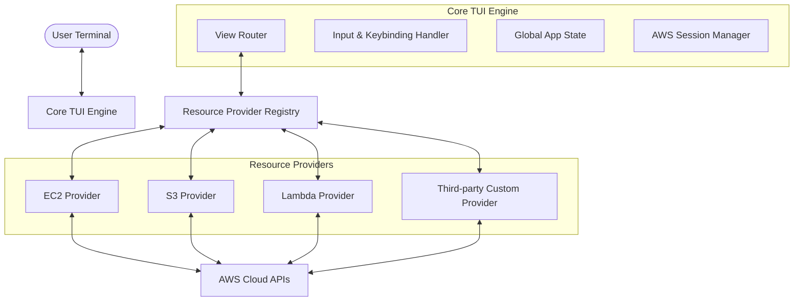

# Architecture Design: aws-tui

`aws-tui` is a fast, terminal-based UI for managing AWS infrastructure, inspired by the workflow of `k9s`. Given the vast and expanding ecosystem of AWS resources (EC2, S3, RDS, Lambda, etc.), the core design requirement of `aws-tui` is **modularity and high extensibility**.

This document outlines the system architecture, core design patterns, extensibility strategies, TUI framework selection, and database/state management.

---

## 1. High-Level Architecture

The system is split into two primary layers:
1. **Core TUI Engine**: Responsible for rendering views (tables, detailed info, log streams, search/filter inputs), managing the active window state, handling global keybindings, and routing events.
2. **Resource Providers (Modules)**: Autonomous, loosely coupled modules that know how to authenticate, fetch, filter, format, describe, and execute custom operations on specific AWS resources.



---

## 2. Key Architectural Concepts

### Core TUI Engine
The central engine coordinates the application lifecycle. It initializes the terminal user interface, runs the main event loop, handles global commands (e.g., `:ec2`, `:s3` to switch views), manages credential profiles, and renders layouts.

### Resource Provider
A Resource Provider defines the behavior, styling, and commands for a specific AWS resource type (e.g., EC2 Instance). Each provider must implement a standard interface to register with the Core Engine. 

### Views & Controllers
Views are generic components (e.g., `TableView`, `DescribeView`, `LogView`, `ErrorView`) that the Core Engine renders. Providers supply the raw data, and the TUI engine maps that data to these generic views. This prevents duplication of UI rendering logic across different providers.

---

## 3. Extensibility & Plugin Strategy

To support the massive number of AWS entities and enable third-party additions, we must choose an extensibility mechanism. Below is a comparison of options considered for Go:

### Option A: Native Go Plugins (`plugin` package)
* **How it works**: Compiles provider modules into `.so` shared libraries loaded at runtime via `plugin.Open()`.
* **Pros**: Native Go execution, dynamic loading at runtime without recompiling the core application.
* **Cons**: Extremely brittle. The plugin and host binary must be compiled with the *exact* same version of the Go compiler, the same dependency versions, and the same build flags. It has limited platform support (mainly Linux and macOS, no stable Windows support).

### Option B: HashiCorp `go-plugin` (gRPC-based Plugins)
* **How it works**: Plugins run as separate, independent processes. The Core Engine and plugins communicate via gRPC over local TCP or Unix sockets.
* **Pros**: Highly robust. Plugins are decoupled from the host Go version and compile options. Language-agnostic (plugins can be written in Rust, Python, Go). If a plugin crashes, the TUI host remains unaffected.
* **Cons**: Introduces IPC overhead (negligible for human-scale UI interaction, but requires serialization). Increases deployment complexity (distributing multiple binaries).

### Option C: Compile-Time Provider Registry (Idiomatic Go)
* **How it works**: Providers are built as standard Go packages within the repository or imported as external modules. They register themselves during initialization (`init()`) in a centralized registry.
* **Pros**: Simple, highly performant, type-safe, compile-time checked, works seamlessly across all platforms (Windows, Linux, macOS) without extra runtime dependencies.
* **Cons**: Adding a new provider requires rebuilding the application.

### Recommended Strategy
We propose a **hybrid approach**:
1. **Primary Pattern (Compile-Time Registry)**: All core AWS resources (EC2, S3, RDS, Lambda, etc.) will be written as separate modules inside the main codebase and registered statically. This ensures maximum stability, easy distribution as a single binary, and zero runtime overhead.
2. **Secondary/Advanced Pattern (gRPC plugin wrapper)**: We will define a `gRPCResourceProvider` that implements the standard provider interface. If a user wants to load a dynamic plugin, they run the external plugin binary, and the gRPC provider routes requests to it over the local network. This keeps the core lightweight while enabling true runtime dynamic extensibility.

---

## 4. The Core Interfaces

To achieve compile-time and gRPC extensibility, we define a standard interface for resource management.

```go
package pkg

import (
	"context"
)

// Resource represents a generic AWS entity instance.
type Resource struct {
	ID       string            // Unique identifier (e.g., ARN or InstanceID)
	Name     string            // Friendly name
	Status   string            // State (e.g., running, terminated, active)
	Metadata map[string]string // Key-value pairs for additional quick details
	Raw      interface{}       // Raw AWS SDK struct for custom operations
}

// ColumnDefinition defines how to extract and display table columns.
type ColumnDefinition struct {
	Header    string
	Width     int
	ValueFunc func(r Resource) string
}

// CustomAction defines custom hotkeys/commands for a resource (e.g., "ssh", "download").
type CustomAction struct {
	Name        string
	Description string
	Hotkey      string // Key combination (e.g., 's', 'ctrl-d')
	ActionFunc  func(ctx context.Context, r Resource) error
}

// ResourceProvider is the core interface every AWS entity handler must implement.
type ResourceProvider interface {
	// Metadata
	GetResourceType() string   // e.g. "EC2 Instances"
	GetShortNames() []string   // e.g. ["ec2", "instance"]
	GetCategory() string     // e.g. "Compute"

	// Data Fetching
	List(ctx context.Context, filters map[string]string) ([]Resource, error)
	Describe(ctx context.Context, id string) (string, error) // YAML format string of details
	Delete(ctx context.Context, id string) error

	// UI Layout
	GetColumns() []ColumnDefinition
	GetCustomActions() []CustomAction
}
```

---

## 5. TUI Engine & Framework Selection

To build the user interface, we evaluated the two major Go TUI frameworks:

| Feature | `tview` (and `gdamore/tcell`) | `bubbletea` (Charm CLI ecosystem) |
| :--- | :--- | :--- |
| **Architecture** | Widget-based, imperative | Model-View-Update (Elm Architecture) |
| **Complexity** | Low-to-Medium (out-of-the-box tables, lists, forms) | Medium-to-High (requires managing event routing manually) |
| **Customizability**| Moderate (restricted by predefined widget behavior) | Extreme (complete control over pixels, styling, layout) |
| **Performance** | Extremely fast and CPU-efficient | Very fast, but styling and nested models can cause overhead if not optimized |

### Decision
We will use **`tview`** (built on top of `tcell`) as our primary TUI engine.
* **Why**: `k9s` itself is built using `tview`. `tview` excels at standard, layout-driven, data-dense forms and tables with built-in navigation and text parsing. For a utility tool focused on tables, log streams, and command-line dialogs, `tview` allows rapid and robust development.
* **Alternative**: If we require highly complex dynamic animations or absolute pixel-level UI control in the future, we can bridge `tview` with `bubbletea` components, or isolate the view layer through interface boundaries.

---

## 6. Directory Layout

The project structure enforces clean separation between the TUI host, AWS client wrappers, and resource providers.

```text
aws-tui/
├── cmd/
│   └── aws-tui/
│       └── main.go                 # Entrypoint
├── pkg/
│   ├── provider/
│   │   ├── registry.go             # Provider registration & lookup logic
│   │   └── types.go                # Core interfaces (ResourceProvider, etc.)
│   ├── providers/
│   │   ├── ec2/
│   │   │   └── provider.go         # EC2 implementation of ResourceProvider
│   │   ├── s3/
│   │   │   └── provider.go         # S3 implementation of ResourceProvider
│   │   └── lambda/
│   │       └── provider.go         # Lambda implementation of ResourceProvider
│   └── awsclient/
│       └── client.go               # AWS Client wrapper (session, profiles)
├── internal/
│   └── tui/
│       ├── app.go                  # Main TUI Loop, views coordination
│       ├── table.go                # Reusable table renderer
│       └── logview.go              # Reusable log-streaming renderer
├── docs/
│   └── architecture.md             # This document
└── README.md                       # High-level overview & developer guide
```

---

## 7. State Management & Lifecycle

1. **Initialization**: On startup, `aws-tui` checks the standard AWS config (`~/.aws/config`, `~/.aws/credentials`) or reads environment variables. It instantiates the `awsclient.SessionManager`.
2. **Discovery**: The `registry` registers all compile-time modules.
3. **Event Loop**:
   - The user types a command (e.g., `:s3`) or presses `Enter` on a row.
   - The TUI Engine determines which provider is active.
   - It runs the provider's `List` call inside a background Goroutine to avoid blocking the main TUI thread.
   - While fetching, a loading spinner is shown.
   - Once fetched, the TUI engine parses `GetColumns()` and renders the table.
4. **Context Swapping**:
   - Keypresses are routed to the active provider's `CustomActions`. For example, pressing `s` on an EC2 instance row invokes the "ssh" action, which starts a terminal sub-process or session manager connection.
